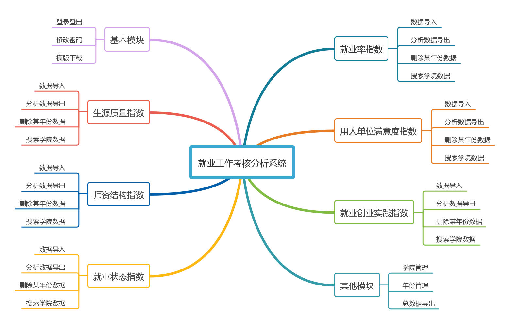
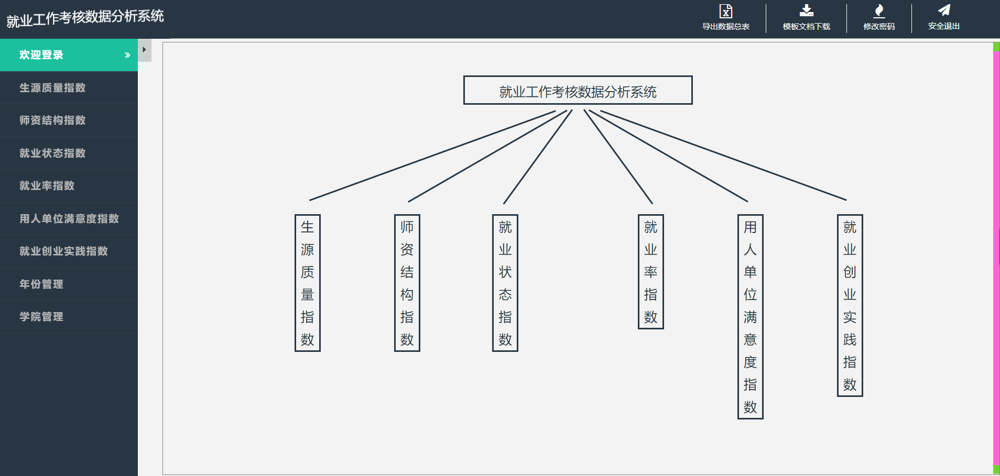
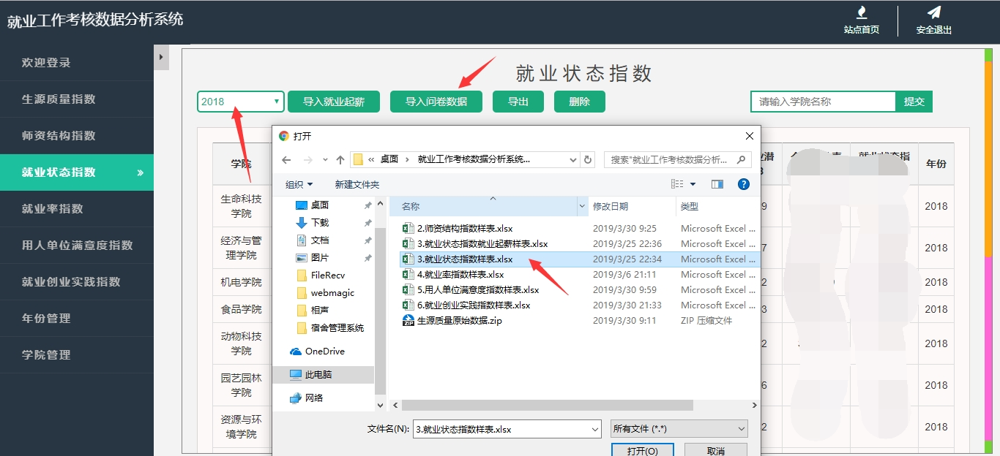
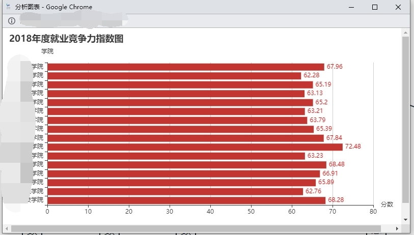

<h1 align="center">indexEvaluation</h1>

#### 项目介绍

就业数据对于高校单位的招生就业处来说，是考核工作成效的重要指标。目前好多高校依然处于管理人员手工通过Excel进行计算的阶段，对于每年上万学生毕业就业的高校来说，数据量巨大，运算复杂。并且人工运算出错率高，速度缓慢。

本系统用于分析《本科毕业生就业竞争力指数评价体系》的一整套系统，对生源质量指数、师资结构指数、就业状态指数、就业率指数、用人单位满意度指数、就业创业实践指数进行分析计算，数据一键导入，分析数据一键导出，最终通过导出总表的方式，完成对就业工作考核。将管理人员从传统枯燥乏味的分析计算中解脱出来，极大的提高了办公效率。

#### 模块介绍

#### 技术选型

|                           框架                            |         说明          |  版本   |
| :-------------------------------------------------------: | :-------------------: | :-----: |
|   [Spring Boot](https://spring.io/projects/spring-boot)   |     应用开发框架      |  2.1.1  |
|            [MySQL](https://www.mysql.com/cn/)             |     数据库服务器      |   5.7   |
|         [Druid](https://github.com/alibaba/druid)         | JDBC 连接池、监控组件 |  1.1.9  |
| [MyBatis](http://www.mybatis.org/mybatis-3/zh/index.html) |    数据持久层框架     |  3.4.6  |
|         [MyBatis-Plus](https://mp.baomidou.com/)          |  Mybatis 增强工具包   | 3.0-RC3 |
|               [Poi](http://poi.apache.org/)               |     Office解析库      |   3.9   |
|              [Ant](https://ant.apache.org/)               |     自动化工具包      |  1.9.4  |
|          [Thymeleaf](https://www.thymeleaf.org/)          |  扩展性强的模板引擎   | 3.0.11  |

#### 部分页面展示

